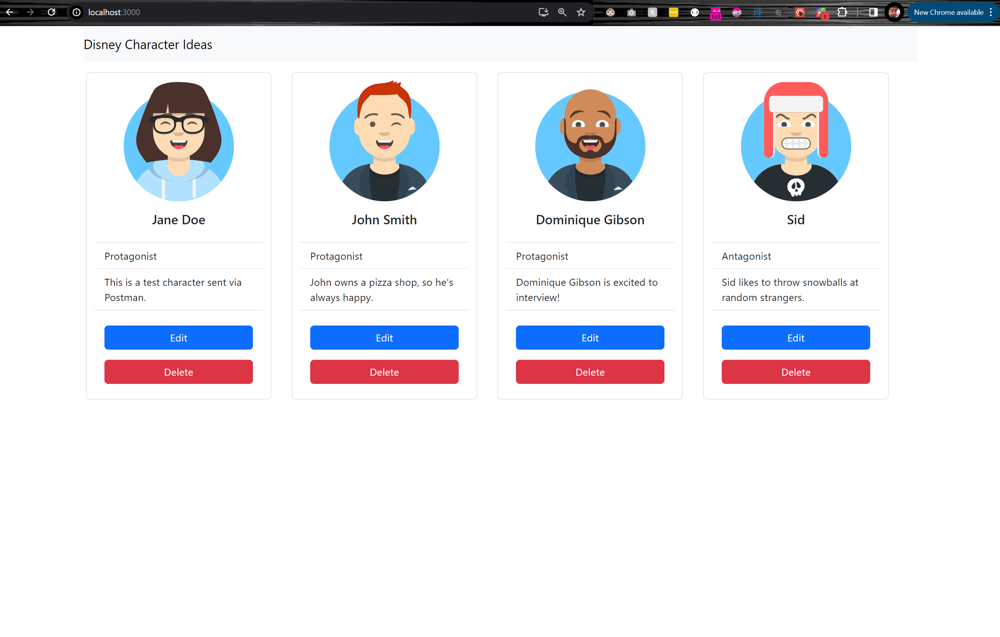

# disney-react
A simple (unfinished) React front-end for creating movie character ideas. I ran out of time before I could finish it, but the idea is just to demonstrate a React front-end hitting a Node API, which queries a Postgres database. This and the corresponding API are things I tried to quickly code up the day of my interview, so they're far from production grade polish (not linted, not using env variables, hard-coded local db and port variables, etc.). The avatars are customizable with many options, though I didn't get a chance to create the edit page.

