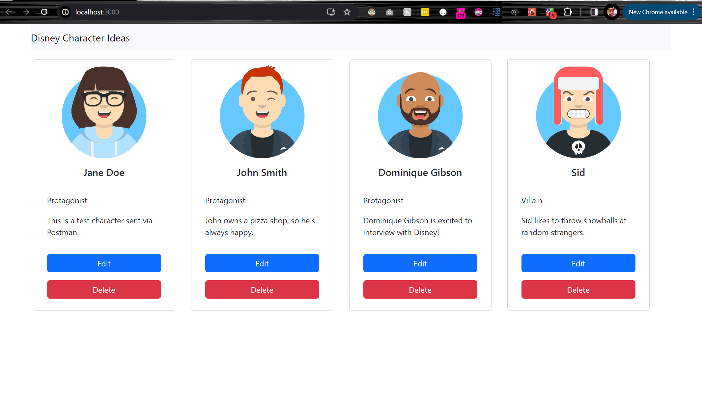

# disney-react
A simple React front-end for creating movie character ideas. I ran out of time before I could finish it, but the idea is just to demonstrate a React front-end hitting a Node API, which queries a Postgres database.

